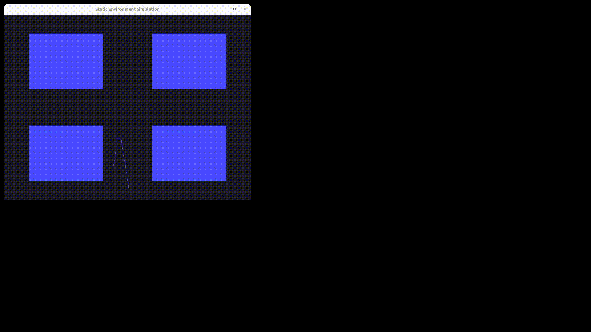
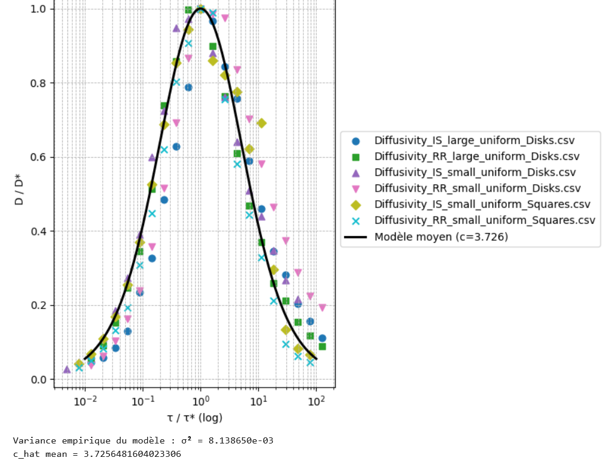

# Dispersal of Motile Microorganisms in Porous Media

Numerical simulation and visualization of run-and-tumble particles
moving through complex porous environments.

<p align="center">
  
</p>

---

## Overview

How does the random motion of a microscopic active agent inside a
porous medium lead to macroscopic diffusion?

This project implements a high-performance C++17 simulation framework
for studying the transport of active particles in heterogeneous
environments and experimentally testing theoretical diffusion laws.

---
## Academic Context

This project was developed as a computational framework for studying transport phenomena in complex porous media, during a research internship at CNRS.

Its primary objective is to investigate how microscopic stochastic dynamics lead to macroscopic diffusion and to experimentally test theoretical predictions regarding universal diffusion laws.

The framework combines numerical simulation, scientific visualization and statistical analysis within a single environment.

---


## Main Result

<p align="center">
  
</p>

*Universal collapse of effective diffusivity data obtained from
different obstacle geometries and transport regimes.*

---

The simulations reproduce the universal diffusivity law reported in
the literature.

Despite large differences in obstacle geometry and particle dynamics,
all measurements collapse onto a single master curve when expressed
using the appropriate dimensionless parameters.

This result suggests that transport in porous media can be described
by a common scaling law independent of microscopic details.

## Features

* Simulation of active particles undergoing run-and-tumble dynamics.
* Collision handling in heterogeneous porous environments.
* Support for effectively infinite simulation domains.
* Real-time OpenGL visualization of particle trajectories.
* Generation of large trajectory datasets for statistical analysis.
* Estimation of effective diffusivities across a wide range of transport regimes.
* Reproduction and verification of universal diffusion laws reported in the literature.
* Extensible object-oriented architecture for implementing new obstacle geometries and transport models.

---

## Architecture

The project was built using a modular architecture, and rely on three main components

### Numerical Simulation Engine

Responsible for the physical evolution of the system:

* particle dynamics integration;
* collision detection and response;
* trajectory generation;
* large-scale data production.
* object-oriented design


### Visualization Layer

Built with OpenGL and GLFW.

Provides:

* real-time trajectory rendering;
* visualization of porous environments;
* interactive exploration of simulation results.

### Data Analysis Tools

Dedicated to:

* statistical processing of trajectories;
* diffusivity estimation;

---

## Technical Stack

| Component        | Technology     |
| ---------------- | -------------- |
| Language         | C++17          |
| Graphics API     | OpenGL         |
| Windowing        | GLFW           |
| OpenGL Loader    | GLAD           |
| Mathematics      | GLM            |
| Random Processes | STL            |
| Build System     | Make           |
| Platforms        | Windows, Linux |

---

## Building

### Dependencies

The graphical module relies on the following libraries:

* OpenGL
* GLFW
* GLAD
* GLM

Install the required dependencies according to your platform.

### Windows (MSYS2 / MinGW64) / Linux

```bash
make clean ; make
./main
```

The project was developed under Windows and successfully tested on Linux during large-scale simulation campaigns. The server Glenan of the Université Claude Benard Lyon 1 (UCBL) was used to execute the simulation code, in the way of obtaining a sufficient dataset.

---

## Usage

### Particle Initialization

The `Mobile` class represents an active particle.

```cpp
Mobile(x0, r, Dr, tau, theta0, mu);
```

where:

| Parameter | Description                      |
| --------- | -------------------------------- |
| x0        | Initial position                 |
| v         | Particle velocity                |
| Dr        | Rotational diffusion coefficient |
| tau       | mean run time                    |
| theta0    | Initial orientation              |
| mu        | Collision escape probability     |

### Environment Initialization

Currently supported environments:

```cpp
"empty"
"uniform_Disks"
"uniform_Squares"
```

Environment creation requires:

* obstacle radius;
* fundamental domain radius;
* environment type.

### Running Simulations

Different methods of the `Mobile` class allow:

* trajectory generation;
* diffusivity estimation;
* statistical data production;
* real-time visualization.

---

## Future Work

Several extensions are currently under consideration:

* additional obstacle geometries;
* random porous medium generation;
* multi-particle simulations;
* CPU parallelization for large parameter sweeps;
* graphical improvements and bug fixes;
* performance optimization for massive data production.

---

## References

[1] Tommaso Pietrangeli, *Bacterial Motion in Confinement*, HAL, 2025

[2] T. Pietrangeli, R. Foffi, R. Stocker, C. Ybert, C. Cottin-Bizonne, F. Detcheverry, *Disper-
sion of microorganisms : one law to rule them all*, CNRS Physics, 2025

---

## Author

**Jules Breugnot**

Université Claude Bernard Lyon 1

for any question or request contact me at jules.breugnot-mathE@etu.univ-lyon1.fr

